# NCL-01-CN-001 — Đăng nhập hệ thống · Báo cáo kiểm thử

> **Công việc**: `NCL-01-CN-001-CV-05` · 🟩 `FE-QA` · Jira `VHPT-18`
> **Ngày chạy**: 08/10/2026 · **Môi trường**: Windows 11, Chrome (Playwright), PostgreSQL 17 (Docker), backend Spring Boot 3.5
> profile `dev`, frontend Vite 8 · **Dữ liệu**: `R__seed_dev_sample_data.sql`, mật khẩu chung `Fitness@2026`

## 1. Kết quả tổng hợp

| Lớp kiểm thử | Công cụ | Số ca | Đạt |
|---|---|---|---|
| API + cơ sở dữ liệu (máy chủ) | JUnit 5, MockMvc, Testcontainers PostgreSQL 17 | 32 | **32** |
| Giao diện (component + luồng trang, API giả lập) | Vitest, Testing Library, MSW | 25 | **25** |
| Đầu-cuối trên hệ thống thật, 1280 px và 360 px | Playwright + Chrome | 10 | **10** |
| Lint, kiểm tra kiểu, build | ESLint, `tsc -b`, `vite build`, `mvnw verify` | — | Sạch |

## 2. Tiêu chí chấp nhận

| Tiêu chí | Mức | Kết quả | Bằng chứng |
|---|---|---|---|
| `TC-01` Lễ tân đăng nhập đúng trên máy quầy đã đăng ký → trang chính theo vai trò lễ tân, phiên gắn với máy quầy | Cao | ✅ Đạt | E2E `TC-03 → TC-01` (truy vấn `user_sessions`: `COUNTER`, đúng máy, đúng câu lạc bộ); `LoginPage.test.tsx`; `AuthIntegrationTest$Tc01` |
| `TC-02` Sai mật khẩu 5 lần liên tiếp → lần thứ 6 tạm khóa 15 phút, báo thời gian chờ | Cao | ✅ Đạt | E2E `TC-02` (giao diện đếm ngược + API trả `423`, `Retry-After` > 14 phút, CSDL `failed_login_attempts = 5`); `LoginForm.test.tsx`; `AuthIntegrationTest$Tc02` (kể cả hết khóa đúng giây thứ 900) |
| `TC-03` Máy tính bảng mới chưa đăng ký → yêu cầu quản lý đăng nhập để đăng ký máy | Cao | ✅ Đạt | E2E `TC-03 → TC-01`, E2E `TC-03` lễ tân bị từ chối; `CounterPage.test.tsx`, `DeviceRegistrationPage.test.tsx`; `AuthIntegrationTest$Tc03`, `CounterDeviceIntegrationTest` |
| `TC-04` Đăng nhập thành công hoặc thất bại đều ghi người thực hiện, nội dung, thời điểm | Cao | ✅ Đạt | E2E `TC-04` (đối chiếu dòng nhật ký + thử `DELETE` bị từ chối); `AuthIntegrationTest$Tc04` (thời điểm chính xác, `UPDATE/DELETE/TRUNCATE` bị trigger chặn) |

## 3. Dữ liệu kiểm thử đã dùng

| Tài khoản | Vai trò | Dùng cho |
|---|---|---|
| `quanly.caugiay` | Quản lý câu lạc bộ | Đăng ký máy quầy (TC-03) |
| `letan.caugiay` | Lễ tân, Fitness Cầu Giấy | Đăng nhập trên máy quầy (TC-01) |
| `letan.haibatrung` | Lễ tân, Fitness Hai Bà Trưng | Bị từ chối trên máy chưa đăng ký (TC-03) |
| `ketoan` (1280 px), `kythuat.caugiay` (360 px) | Kế toán, kỹ thuật | 5 lần sai + lần thứ 6 (TC-02) |
| `tuvan.caugiay` | Nhân viên tư vấn | 1 lần sai + 1 lần đúng (TC-04) |
| `hlv.caugiay` | Huấn luyện viên cá nhân | Đăng nhập trên máy tính / điện thoại |

Máy quầy được tạo mới mỗi lượt chạy với tên `Quầy E2E <kích thước> <số>`. Trước và sau khi chạy, kịch bản gỡ tạm khóa
các tài khoản mẫu để có thể chạy lại ngay.

## 4. Nhật ký trong cơ sở dữ liệu sau lượt chạy E2E (TC-04)

```
 id | thời điểm |         event_type         |         ly_do            |    username    | client  | detail
----+-----------+----------------------------+--------------------------+----------------+---------+--------------------------------------------------------------
  2 | 04:11:08  | LOGIN_SUCCEEDED            |                          | quanly.caugiay | OFFICE  | Đăng nhập thành công trên máy tính văn phòng
  3 | 04:11:09  | DEVICE_REGISTERED          |                          | quanly.caugiay | OFFICE  | Đăng ký máy quầy "Quầy E2E desktop-1280 68829" cho Fitness Cầu Giấy
  4 | 04:11:09  | LOGOUT                     |                          | quanly.caugiay | OFFICE  | Đăng xuất khỏi máy tính văn phòng
  5 | 04:11:09  | LOGIN_SUCCEEDED            |                          | letan.caugiay  | COUNTER | Đăng nhập thành công trên máy quầy "Quầy E2E desktop-1280 68829" (Fitness Cầu Giấy)
  6 | 04:11:10  | LOGOUT                     |                          | letan.caugiay  | COUNTER | Đăng xuất khỏi máy quầy
  8 | 04:11:13  | LOGIN_FAILED               | INVALID_PASSWORD         | ketoan         | OFFICE  | Đăng nhập thất bại: sai mật khẩu (lần 1/5 liên tiếp)
 12 | 04:11:16  | LOGIN_FAILED               | INVALID_PASSWORD         | ketoan         | OFFICE  | Đăng nhập thất bại: sai mật khẩu (lần 5/5 liên tiếp)
 13 | 04:11:16  | ACCOUNT_TEMPORARILY_LOCKED | TOO_MANY_FAILED_ATTEMPTS | ketoan         | OFFICE  | Tạm khóa đăng nhập 15 phút đến 04:26 08/10/2026 sau 5 lần nhập sai mật khẩu liên tiếp
 14 | 04:11:16  | LOGIN_REJECTED             | ACCOUNT_LOCKED           | ketoan         | OFFICE  | Từ chối đăng nhập: tài khoản đang tạm khóa đến 04:26 08/10/2026
 15 | 04:11:17  | LOGIN_FAILED               | INVALID_PASSWORD         | tuvan.caugiay  | OFFICE  | Đăng nhập thất bại: sai mật khẩu (lần 1/5 liên tiếp)
 16 | 04:11:18  | LOGIN_SUCCEEDED            |                          | tuvan.caugiay  | OFFICE  | Đăng nhập thành công trên máy tính văn phòng
 18 | 04:11:24  | LOGIN_SUCCEEDED            |                          | quanly.caugiay | MOBILE  | Đăng nhập thành công trên điện thoại
 21 | 04:11:26  | LOGIN_SUCCEEDED            |                          | letan.caugiay  | COUNTER | Đăng nhập thành công trên máy quầy "Quầy E2E mobile-360 85167" (Fitness Cầu Giấy)
```

Mỗi dòng còn lưu mã tài khoản, phiên, máy quầy, câu lạc bộ, địa chỉ IP và trình duyệt. Lệnh
`DELETE FROM auth_audit_logs …` bị từ chối: *auth_audit_logs chỉ cho phép thêm mới, không được DELETE (QTN-02)*.

## 5. Ảnh chụp luồng chính

| Bước | 1280 px | 360 px |
|---|---|---|
| S1/S2 Đăng nhập | 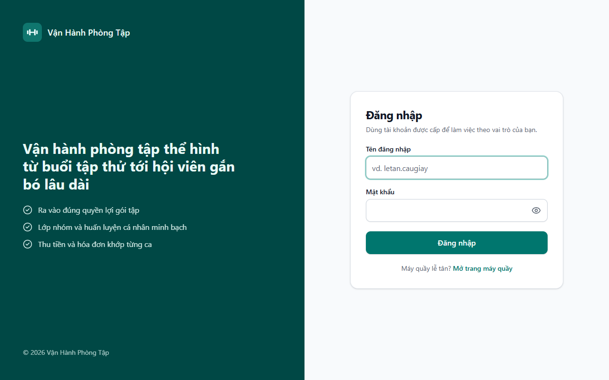 | 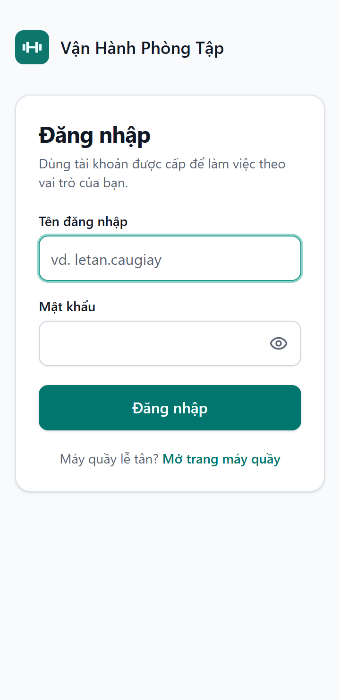 |
| S6 Trang chính huấn luyện viên | 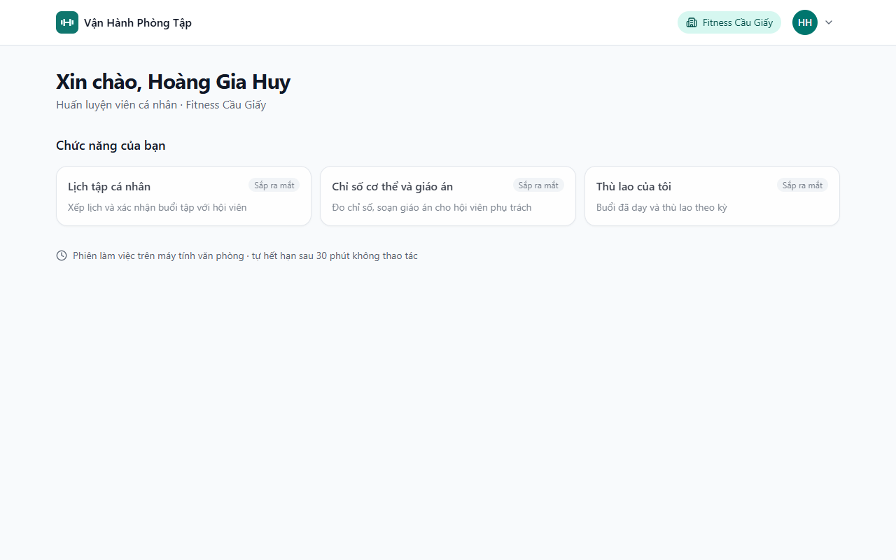 | 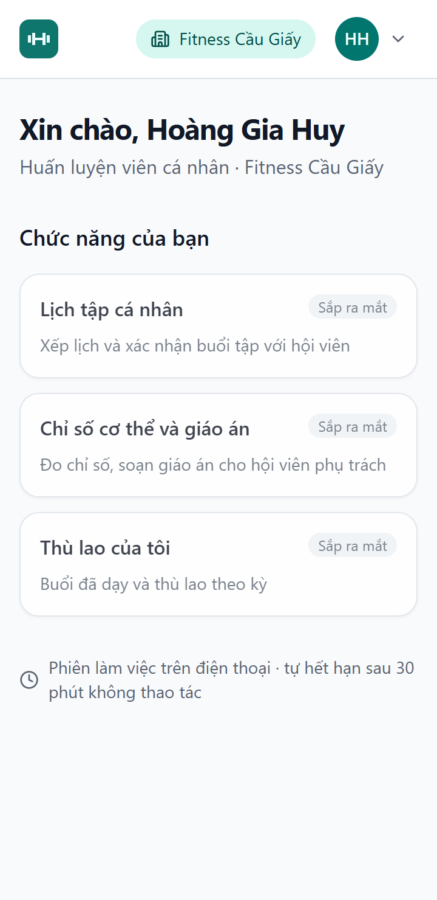 |
| S4 Máy quầy chưa đăng ký (TC-03) | 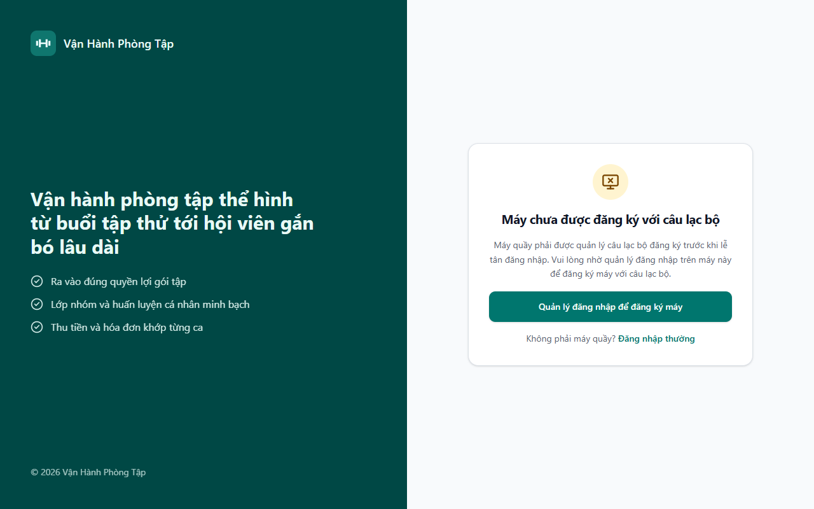 | 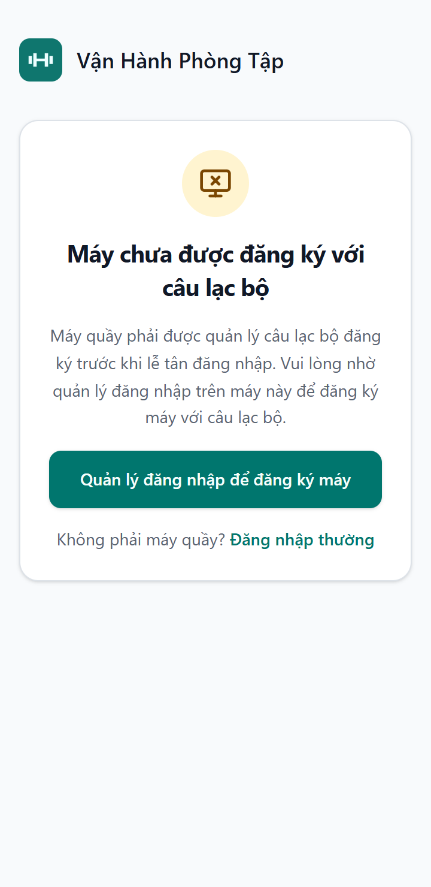 |
| S5 Đăng ký máy — bước 2 | 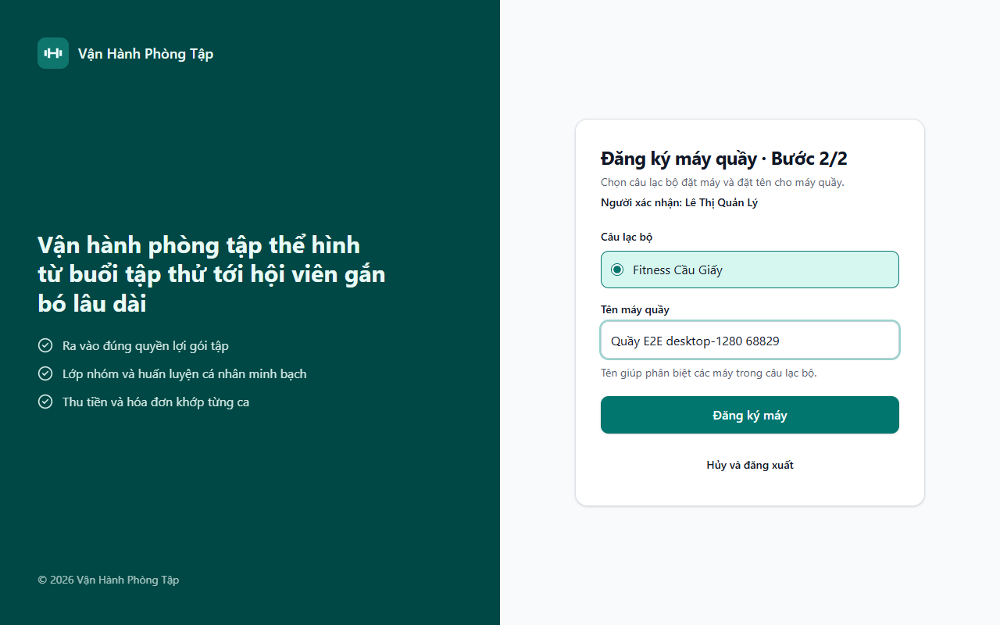 | 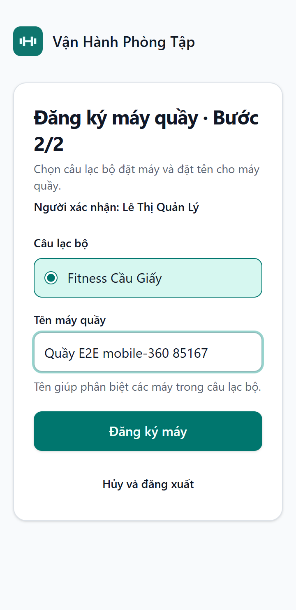 |
| S3 Đăng nhập tại quầy | 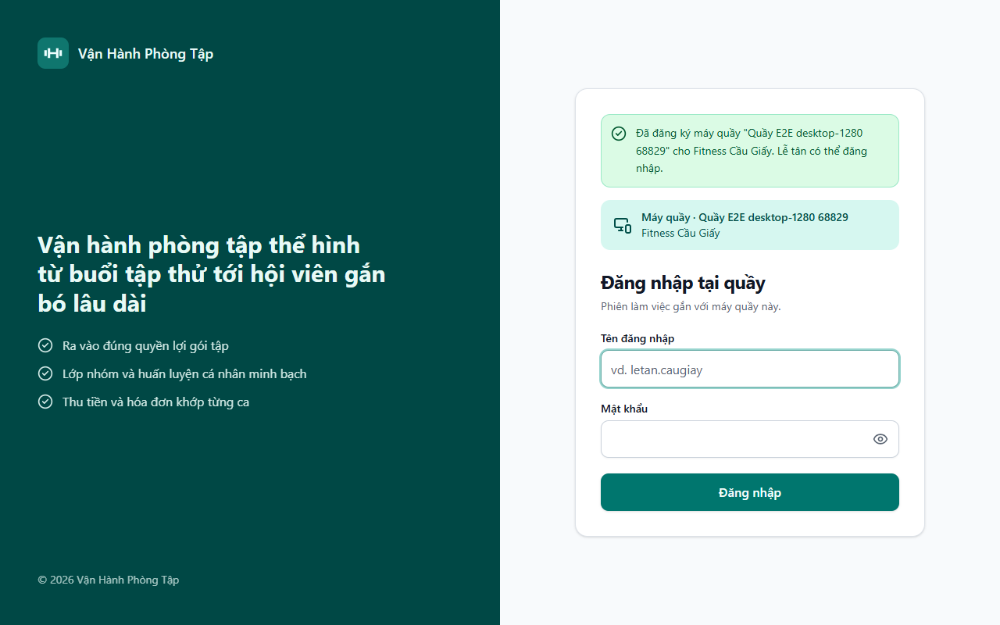 | 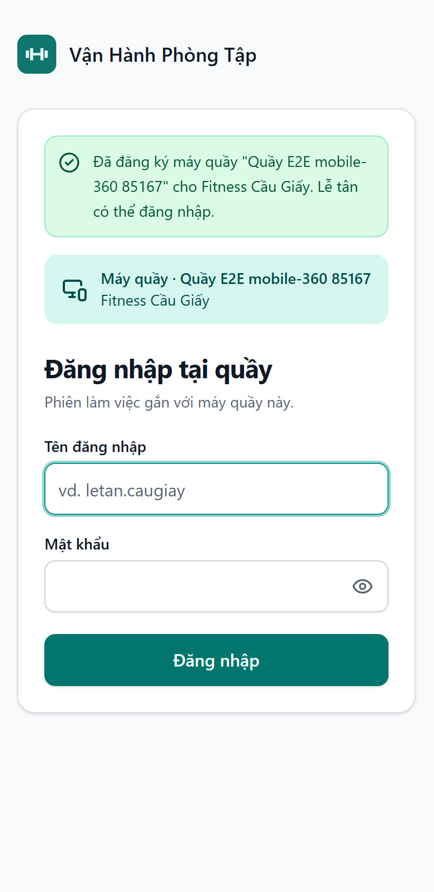 |
| S6 Trang chính lễ tân (TC-01) | 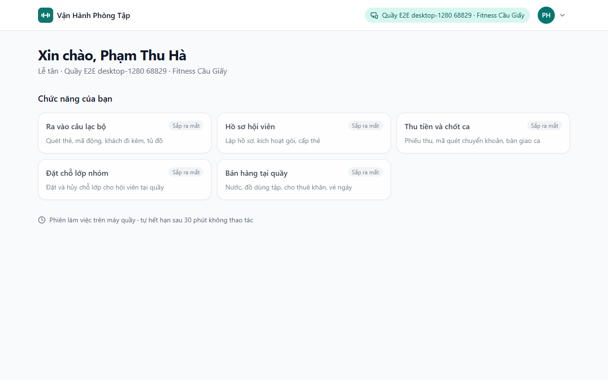 | 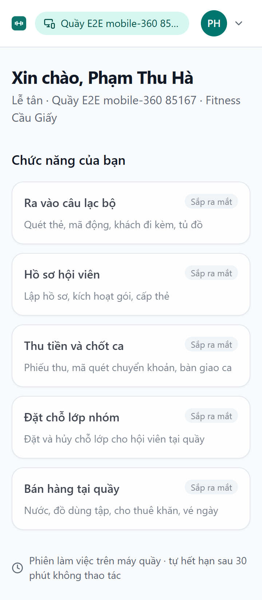 |
| Lễ tân trên máy chưa đăng ký (TC-03) | 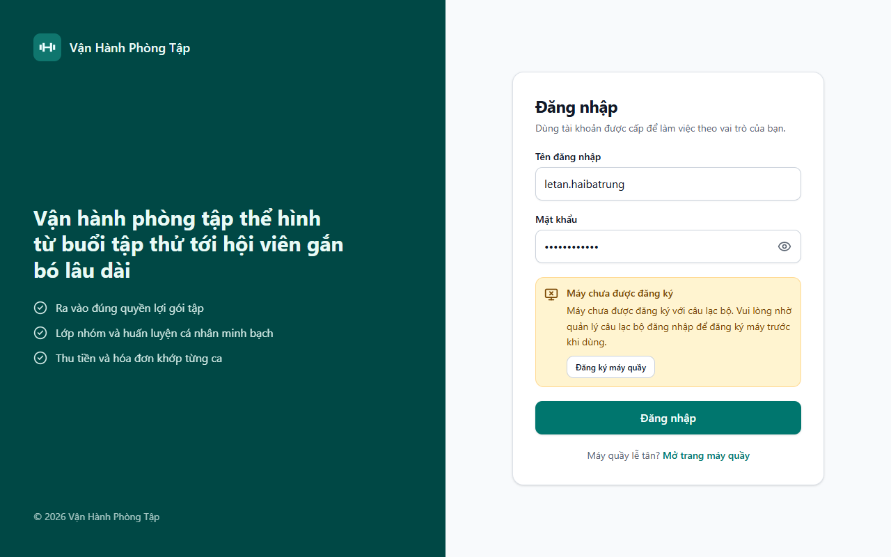 | 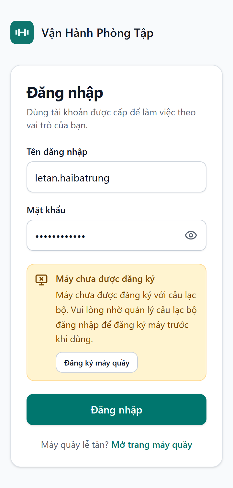 |
| Tạm khóa 15 phút (TC-02) | 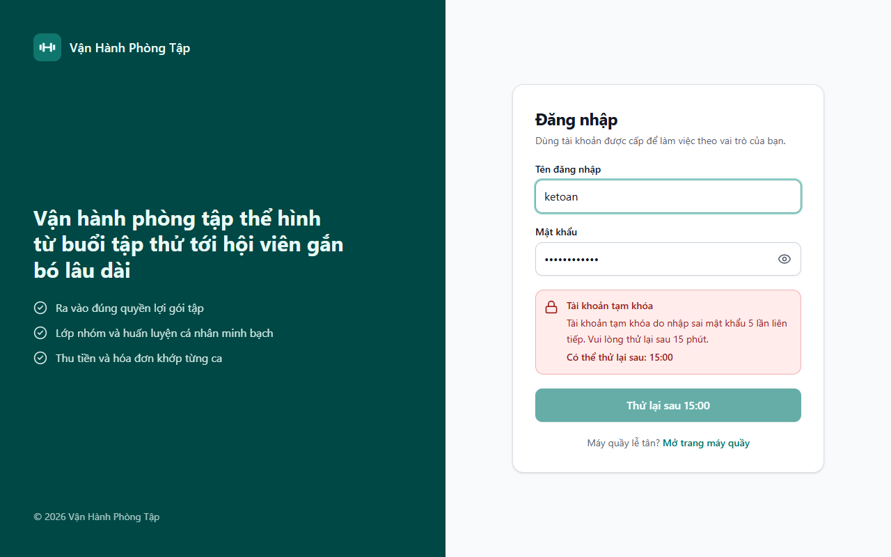 | 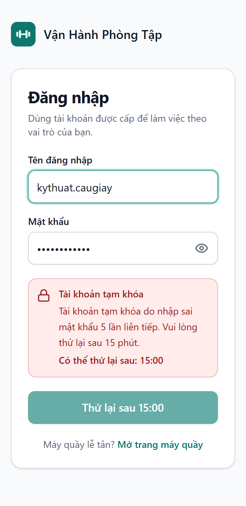 |

Mọi màn hình ở cả hai kích thước đều được kiểm tra tự động không tràn ngang.

## 6. Ngoài phạm vi / ghi nhận

- Không có lỗi tồn đọng. Hai lỗi phát hiện trong quá trình kiểm thử đã sửa trước khi bàn giao: kiểu cột `token_hash`
  không khớp ánh xạ (bắt bởi kiểm tra lược đồ của Hibernate) và các migration rỗng của skeleton bị Flyway ghi là đã
  chạy (khắc phục bằng `spring.flyway.target`).
- Kiểm thử hết phiên 30 phút dùng đồng hồ điều khiển được (máy chủ) và đồng hồ giả (giao diện), không chờ thời gian thật.

## 7. Cách chạy lại

Xem [docs/development/local-setup.md](../../development/local-setup.md) mục 4.
